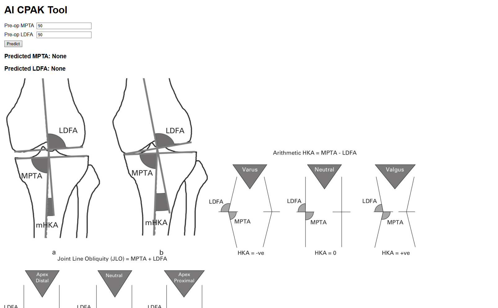

# NYU Langone Medical Center Knee Alignment Research

@author Jack Bosco

---

## NEW: Website Tool [LINK](https://cd23g723swvsaiowa6kmu6fn3u0xzmne.lambda-url.us-east-1.on.aws/)

## What is the Goal?

This is a web application for the AI CPAK project https://github.com/JackBosco/AI_CPAK

## How do I use this?

Visit the link above to use the web tool in your browser. 



### Specifications

We use FastAPI with python to convert the Desktop application to a web application + API.
To access the api programatically use the endpoint <URL>/api/predict and submit the 'mpta', 'ldfa' fields like so:
```json
{
  "httpMethod": "POST",
  "path": "/api/predict",
  "requestContext": {},
  "version": "1.0",
  "body": "{ \"mpta\": \"88.5\", \"ldfa\": \"85.2\" }"
}
``` 

Example Response:
```json
{
  "statusCode": 200,
  "headers": {
    "content-length": "50",
    "content-type": "application/json"
  },
  "multiValueHeaders": {},
  "body": "{\"mpta\":89.68032464359646,\"ldfa\":89.4126282330112}",
  "isBase64Encoded": false
}
```

The webapp is deployed with AWS ECR through Docker, allowing for standardization of the development environment.
The webpage is served through AWS Lambda function connected to the ECR container.

linkedin: [linkedin.com/in/JackBosco](https://linkedin.com/in/JackBosco).
